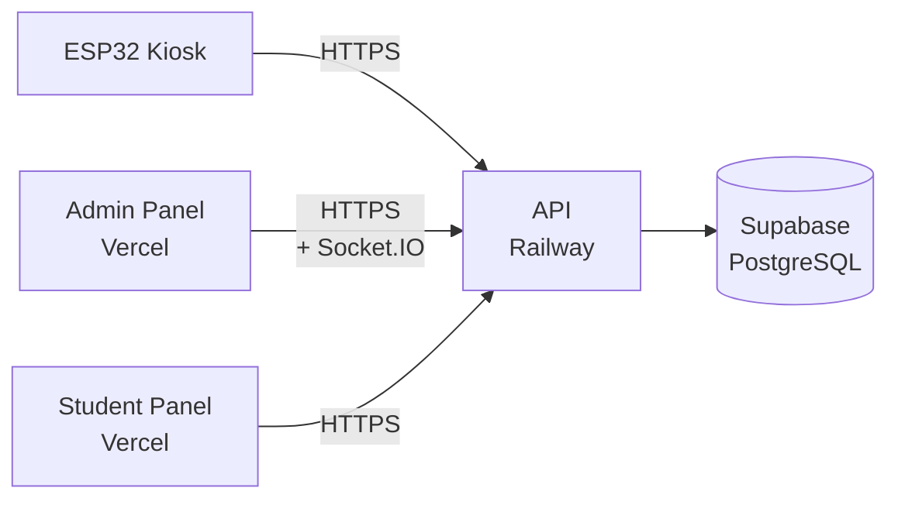

# DineSync Live Deployment Guide

DineSync uses a monorepo structure with separate backend API (`apps/api`) and frontend services (`apps/admin-panel`, `apps/student-panel`), along with shared types and database utilities (`packages/types`, `packages/db`). All services use Supabase as the database.

**Recommended Stack:**
- **Database:** Supabase (PostgreSQL)
- **Backend API:** Railway (Express + Socket.IO)
- **Admin Panel:** Vercel (Next.js)
- **Student Panel:** Vercel (Next.js)
- **Hardware:** ESP32 firmware with RFID/Gas/IR sensors

---

## Local Development Setup

Before deployment, ensure local development works:

```bash
# Install dependencies
pnpm install

# Start all services
pnpm dev
```

This runs:
- **Student Panel:** http://localhost:3001
- **Admin Panel:** http://localhost:3002
- **API:** http://localhost:4000 (Socket.IO at same URL)

---

## 0. Prepare Supabase

1. Create a new Supabase project at [supabase.com](https://supabase.com).
2. Go to **SQL Editor** and run the full contents of `supabase_schema.sql` from the project root.
3. Verify these tables exist:
   - `Admin` (with seeded demo account)
   - `Student` (with seeded demo students)
   - `Card` (RFID cards linked to students)
   - `Device` (ESP32 kiosk devices)
   - `MealSession` (current meal period)
   - `MealStatus` (meal consumption per student)
   - `Log` (activity log)
4. Retrieve your credentials:
   - **Project URL:** In Settings → General
   - **Service Role Key:** In Settings → API

---

## 1. Deploy the API to Railway

The API is an Express.js + Socket.IO service that requires always-on availability for WebSocket connections.

### Prerequisites

- GitHub repository with DineSync code
- Railway account

### Railway Deployment Steps

1. Go to [railway.app](https://railway.app)
2. Click **New Project** → **Deploy from GitHub repo**
3. Select your DineSync repository
4. Railway will automatically detect the `Dockerfile` and use it to build
5. In the Railway dashboard, go to **Variables** and add:

```bash
NODE_ENV=production
PORT=4000
SUPABASE_URL=https://<your-project>.supabase.co
SUPABASE_SERVICE_ROLE_KEY=<your-service-role-key>
JWT_SECRET=<generate-a-32-character-random-string>
JWT_EXPIRES_IN=7d
GAS_ALERT_THRESHOLD=400
GAS_ALERT_CONSECUTIVE_READINGS=3
DEVICE_OFFLINE_THRESHOLD_SECONDS=60
CLIENT_URLS=https://<admin-domain>,https://<student-domain>
```

### Build & Start Configuration

Railway will automatically use the `Dockerfile` in the repository root:
- **Builds** the monorepo packages (types, db, api)
- **Installs pnpm** globally to handle the workspace structure
- **Starts** the API service on port 4000

No additional build command configuration needed in Railway.

### Important Notes for API

- The API must be always-on (no autoscale-to-zero) so Socket.IO connections stay active
- HTTPS is required in production (Railway provides automatic HTTPS)
- `CLIENT_URLS` must match your frontend domains exactly (comma-separated, no spaces)
- Save your public Railway URL (e.g., `https://api-prod.railway.app`) — you'll need it for the frontends and ESP32

---

## 2. Deploy the Admin Panel to Vercel

The Admin Panel is a Next.js dashboard for meal management, staff oversight, and real-time activity monitoring.

### Prerequisites

- GitHub repository (same one)
- Vercel account

### Vercel Deployment Steps

1. Go to [vercel.com](https://vercel.com) → **Add New** → **Project**
2. Import your DineSync GitHub repository
3. Vercel detects it's a monorepo; configure as follows:

   - **Project Name:** `dinesync-admin-panel`
   - **Framework Preset:** Next.js
   - **Root Directory:** `apps/admin-panel`

4. In **Environment Variables**, add:

```bash
NEXT_PUBLIC_API_URL=https://<your-railway-api-url>
NEXT_PUBLIC_WS_URL=https://<your-railway-api-url>
```

5. Click **Deploy**

### Build & Start Commands

Vercel auto-detects Next.js; no need to change build commands.

Default commands work fine:
- **Build:** `next build`
- **Start:** `next start`

**Note:** If Vercel asks for build command override, use:
```bash
pnpm --filter @dinesync/admin-panel build
```

---

## 3. Deploy the Student Panel to Vercel

The Student Panel is a lightweight frontend for students to check meal status (simpler than admin).

### Vercel Deployment Steps

1. Go to [vercel.com](https://vercel.com) → **Add New** → **Project**
2. Import the same DineSync repository (or connect an existing Vercel project)
3. Configure:

   - **Project Name:** `dinesync-student-panel`
   - **Framework Preset:** Next.js
   - **Root Directory:** `apps/student-panel`

4. In **Environment Variables**, add:

```bash
NEXT_PUBLIC_API_URL=https://<your-railway-api-url>
```

5. Click **Deploy**

---

## 4. Update ESP32 Firmware Configuration

The ESP32 kiosk firmware needs your API URL and device credentials.

### Steps

1. Open `firmware/dinesync-kiosk/config.h` in Arduino IDE
2. Update these values:

```cpp
#define WIFI_SSID      "<your-wifi-network>"
#define WIFI_PASSWORD  "<your-wifi-password>"
#define API_BASE_URL   "https://<your-railway-api-url>"
```

3. **Device Credentials** (must match Supabase `Device` table):
   - `DEVICE_ID`: `kiosk-hall-a-01` (or your custom ID)
   - `DEVICE_API_KEY`: `dinesync-dev-key-01` (or your custom key)

These are pre-seeded in the schema but can be updated in Supabase if changed.

4. Connect ESP32 to your computer and upload the firmware via Arduino IDE

---

## 5. Post-Deployment Verification Checklist

After all services are deployed:

- [ ] Supabase project created and schema loaded
- [ ] Railway API deployed and public URL accessible
- [ ] Admin Panel deployed on Vercel
- [ ] Student Panel deployed on Vercel
- [ ] ESP32 firmware configured with correct API URL and WiFi
- [ ] Admin panel accesses Supabase without errors
- [ ] WebSocket connection works (check browser console)
- [ ] ESP32 can send heartbeat to API (check logs)
- [ ] RFID scan on kiosk updates Admin Panel in real-time

---

## 6. Troubleshooting Common Issues

### "Cannot connect to API"
- **Cause:** `NEXT_PUBLIC_API_URL` doesn't match Railway URL
- **Fix:** Copy exact Railway URL and update Vercel env vars

### "Socket.IO connection failed"
- **Cause:** `CLIENT_URLS` on Railway doesn't include Vercel domains
- **Fix:** Update Railway env var with both Vercel URLs separated by commas

### "Admin panel won't load"
- **Cause:** Missing Supabase credentials on API
- **Fix:** Verify `SUPABASE_URL` and `SUPABASE_SERVICE_ROLE_KEY` on Railway

### "ESP32 can't reach API"
- **Cause:** WiFi connection or API URL is wrong
- **Fix:** Check WiFi credentials in `config.h`, verify API is reachable via `curl https://<api-url>/health`

### "Meal status updates not in real-time"
- **Cause:** Socket.IO not connecting properly
- **Fix:** Check browser WebSocket tab in DevTools, verify Railway has persistent connections enabled

---

## 7. Environment Variables Reference

### Railway API (`apps/api`)
| Variable | Purpose |
|----------|---------|
| `PORT` | API server port (default: 4000) |
| `NODE_ENV` | Set to `production` |
| `SUPABASE_URL` | Your Supabase project URL |
| `SUPABASE_SERVICE_ROLE_KEY` | Service role key (for backend operations) |
| `JWT_SECRET` | Random 32+ character string for JWT signing |
| `JWT_EXPIRES_IN` | JWT expiration (e.g., `7d`) |
| `CLIENT_URLS` | Frontend origins (comma-separated) |
| `GAS_ALERT_THRESHOLD` | Gas sensor threshold (default: 400) |
| `GAS_ALERT_CONSECUTIVE_READINGS` | Consecutive readings to trigger alert (default: 3) |
| `DEVICE_OFFLINE_THRESHOLD_SECONDS` | Time before marking device offline (default: 60) |

### Vercel Admin Panel (`apps/admin-panel`)
| Variable | Purpose |
|----------|---------|
| `NEXT_PUBLIC_API_URL` | Railway API URL (public, visible to client) |
| `NEXT_PUBLIC_WS_URL` | Socket.IO URL (usually same as API_URL) |

### Vercel Student Panel (`apps/student-panel`)
| Variable | Purpose |
|----------|---------|
| `NEXT_PUBLIC_API_URL` | Railway API URL |

---

## 8. Monorepo Structure Overview

```
DineSync/
├── apps/
│   ├── api/                # Express + Socket.IO backend
│   ├── admin-panel/        # Next.js admin dashboard
│   └── student-panel/      # Next.js student interface
├── packages/
│   ├── types/              # Shared TypeScript types
│   └── db/                 # Supabase client
├── firmware/
│   └── dinesync-kiosk/     # Arduino ESP32 firmware
├── supabase_schema.sql     # Database schema & seed data
└── pnpm-workspace.yaml     # Monorepo configuration
```

---

## 9. Production Deployment Diagram



---

## 10. Scaling & Maintenance

- **Always-On API:** Keep Railway's Always On toggle enabled
- **Database Backups:** Use Supabase's automated backups
- **Logs:** Check Railway and Vercel logs if issues arise
- **Environment Secrets:** Never commit `.env` files; use platform's secrets manager
- **Updates:** Test changes locally (`pnpm dev`) before deploying
