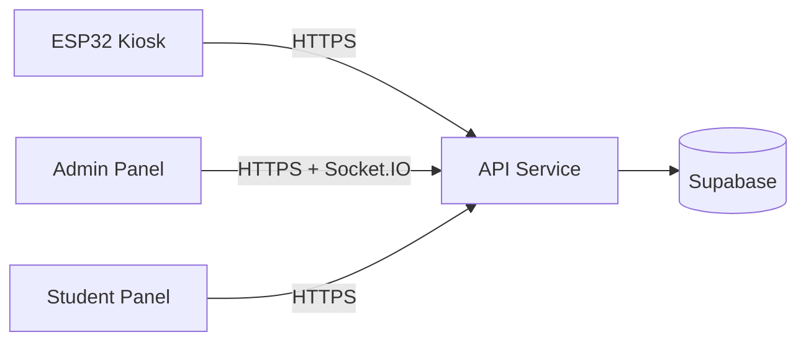

# DineSync Live Deployment Guide

This repo is now buildable, so the remaining work is deployment and configuration. For your requested stack, use:

- Supabase for the database
- Railway for `apps/api`
- Vercel for `apps/admin-panel`
- Vercel for `apps/student-panel`
- ESP32 firmware pointed at the deployed API URL

## 1. Deploy Supabase

1. Create or open your Supabase project.
2. Run the full contents of `supabase_schema.sql` in the SQL editor.
3. Verify that these tables exist:
   - `Admin`
   - `Student`
   - `Card`
   - `Device`
   - `MealSession`
   - `MealStatus`
   - `Log`
4. Keep the seeded admin and test student rows if you want the demo accounts.

## 2. Deploy the API

`apps/api` is a long-running Express + Socket.IO service, so Railway is a good fit.

Railway setup:

1. Create a new Railway service from your GitHub repo.
2. Set the root directory to `Software` if Railway asks for one.
3. Use the build command below.
4. Use the start command below.
5. Add the environment variables below in Railway Variables.

Build command:

```bash
pnpm build
```

Start command for the API package:

```bash
pnpm --filter @dinesync/api start
```

Set these environment variables on the API host:

```bash
NODE_ENV=production
PORT=4000
SUPABASE_URL=https://<your-project>.supabase.co
SUPABASE_SERVICE_ROLE_KEY=<service-role-key>
JWT_SECRET=<long-random-secret>
JWT_EXPIRES_IN=7d
CLIENT_URLS=https://<admin-domain>,https://<student-domain>
DEVICE_OFFLINE_THRESHOLD_SECONDS=60
GAS_ALERT_THRESHOLD=400
GAS_ALERT_CONSECUTIVE_READINGS=3
```

Notes:

- `CLIENT_URLS` must include both frontend origins separated by commas.
- The API must be reachable over HTTPS in production because auth cookies are marked secure.
- Keep the service always-on so Socket.IO and the heartbeat checker continue running.
- After Railway deploys, copy the public Railway URL and use that value as the API base URL in both Vercel apps and the ESP32 firmware.

## 3. Deploy the Admin Panel

Deploy `apps/admin-panel` to Vercel.

Vercel setup:

1. Import the repo into Vercel.
2. Set the root directory to `Software` if needed.
3. Select the `admin-panel` app as the target project.
4. Add the environment variables below.

Set these environment variables:

```bash
NEXT_PUBLIC_API_URL=https://<api-domain>
NEXT_PUBLIC_WS_URL=https://<api-domain>
```

Build command:

```bash
pnpm --filter @dinesync/admin-panel build
```

Start command:

```bash
pnpm --filter @dinesync/admin-panel start
```

## 4. Deploy the Student Panel

Deploy `apps/student-panel` separately on Vercel.

Vercel setup:

1. Import the same repo into a second Vercel project.
2. Set the root directory to `Software` if needed.
3. Select the `student-panel` app as the target project.
4. Add the environment variable below.

Set this environment variable:

```bash
NEXT_PUBLIC_API_URL=https://<api-domain>
```

Build command:

```bash
pnpm --filter @dinesync/student-panel build
```

Start command:

```bash
pnpm --filter @dinesync/student-panel start
```

## 5. Update ESP32 Firmware

Edit `firmware/dinesync-kiosk/config.h` before flashing:

```cpp
#define WIFI_SSID     "<your-wifi>"
#define WIFI_PASSWORD "<your-password>"
#define API_BASE_URL  "https://<railway-api-domain>"
```

Keep `DEVICE_ID` and `DEVICE_API_KEY` aligned with the seeded `Device` row in Supabase.

Current demo values in the repo are:

- `DEVICE_ID`: `kiosk-hall-a-01`
- `DEVICE_API_KEY`: `dinesync-dev-key-01`

## 6. Smoke Test Order

Use this order after deployment:

1. Open the admin panel and log in.
2. Confirm the API health endpoint responds.
3. Confirm the kiosk can reach the API and send a heartbeat.
4. Scan a seeded card and verify the admin log updates live.
5. Trigger a meal consume event and confirm the meal counters change.
6. Test reset and gas alert behavior only after the basics work.

## 7. What Usually Breaks First

- Missing `SUPABASE_SERVICE_ROLE_KEY` on the API host.
- Wrong `CLIENT_URLS`, which causes browser auth/socket failures.
- Forgetting to update `NEXT_PUBLIC_API_URL` after deploying the API.
- Leaving the ESP32 pointed at a private LAN IP instead of the live API URL.
- Using different API domains in Railway, Vercel, and the ESP32 instead of one consistent Railway URL.

## 8. Recommended Production Topology


